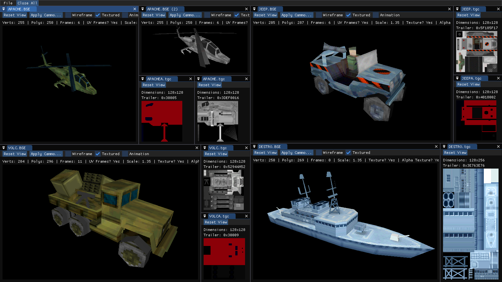

# Real War Asset Viewer
A work in progress viewer for asset files from the PC game [Real War (2001)](https://en.wikipedia.org/wiki/Real_War_(video_game)).

## Goals
1. Ability to open and view various file formats specific to Real War without needing to convert those files first.
2. Creating a reference implementation for rendering graphical files with modern graphics APIs.

## Non-goals
1. Editing capabilities.
2. Exporting files to more common formats.

## File Support Table
✔ - Supported | 🚧 - Planned | ❌ - Not Planned | ❔ - Maybe In The Future
| Ext   | Type         | Status |
|-------|--------------|--------|
| .bmp  | Bitmap       | 🚧     |
| .bse  | Model        | ✔     |
| .dxf  | Autodesk DXF | ❌     |
| .gam  | Game Config  | ❔     |
| .hmp  | ?            | ❔     |
| .lod  | Lodgments    | ❔     |
| .kmd  | Model        | 🚧     |
| .map  | Map Data     | ❔     |
| .mpg  | Video        | 🚧     |
| .msk  | ?            | ❔     |
| .mxs  | 3ds Max Scene | ❌    |
| .oct  | Sector Data  | ❔     |
| .ovl  | Overlay Data | ❔     |
| .prj  | Project      | ❔     |
| .spt  | Sprite       | ✔     |
| .s16  | Sprite       | ✔     |
| .sav  | Game Save    | ❔     |
| .til  | Tile Data    | ❔     |
| .tgc  | Image        | ✔     |
| .vag  | Audio        | 🚧     |

### `bigfile.dat` Support Table
| Ext   | Type         | Status |
|-------|--------------|--------|
| .kwt  | ?            | 🚧    |
| .mis  | Mission      | 🚧    |
| .res  | Resource     | 🚧    |
| .rwt  | ?            | 🚧    |
| .sct  | ?            | 🚧    |
| .swt  | ?            | 🚧    |
| .trg  | Target       | 🚧    |
| .txt  | Text         | 🚧    |
